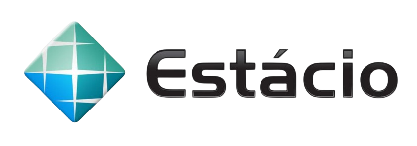

# Doma App

Para uma melhoria na eficiência e na comunicação interna, a empresa “Doma” quer
desenvolver um aplicativo Wear OS para assistência aos funcionários que têm
necessidades especiais, uma forma de solidificar a interação entre os mesmos. App wearable criado baseado no que foi pedido na missão prática do nível 3 (RPG0025 - Lidando com sensores em dispositivos móveis) do Mundo 4 no curso de Desenvolvimento Full-Stack da Estácio.


## Stack utilizada

**Mobile:** Kotlin


## Rodando localmente

### Clone o projeto

```bash
  git clone https://github.com/Alvimm/m4n3
```


### Entre no diretório do projeto

```bash
  cd m4n3
```


## Abra o Android Studio e rode o projeto


## Screenshots

<div style="display: flex; justify-content: center;">
    
    
    
</div>  


## Autor

- [@alvimm](https://www.github.com/Alvimm)